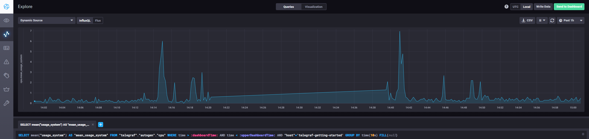
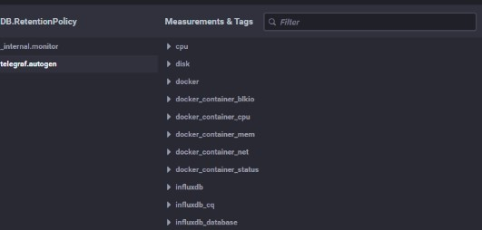

# Домашнее задание к занятию "13.Системы мониторинга"

## Обязательные задания

1. Вас пригласили настроить мониторинг на проект. На онбординге вам рассказали, что проект представляет из себя 
платформу для вычислений с выдачей текстовых отчетов, которые сохраняются на диск. Взаимодействие с платформой 
осуществляется по протоколу http. Также вам отметили, что вычисления загружают ЦПУ. Какой минимальный набор метрик вы
выведите в мониторинг и почему?

**Ответ.**

  -	CPU:
    - CPU utilization
    - Load Average
  - RAM:
    - 	Memory utilization
  -	DISK:
    -	Space utilization
    -	Disk write request avg waiting time
    -	Disk read request avg waiting time
  -	NET:
    -	Response Time ( время отклика на HTTP запрос )
	-	HTTP Request Status ( количество успешных запросов, ошибок 4xx и 5xx ) 


#
2. Менеджер продукта посмотрев на ваши метрики сказал, что ему непонятно что такое RAM/inodes/CPUla. Также он сказал, 
что хочет понимать, насколько мы выполняем свои обязанности перед клиентами и какое качество обслуживания. Что вы 
можете ему предложить?

**Ответ.**

логично что бизнесу нужны несколько другие метрики нежели специалистам
менеджеру мы дадим инструменты которые помогут ему в SLA, SLO и SLI
  -	Response Time ( чтобы он понимал как быстро мы обслуживаем пользователей в среднем )
  -	HTTP Request Status ( как часто возникают ошибки у клиентов при обращении к сервису ) 
  - Uptime average ( чтобы понять время безотказной работы  в среднем )
  - NPS ( метрика удовлетворенности. например в звезлах или оценке, по завершении операции клиентом )
  - жалобы ( количество обращений клиентов связанных с жалобами, тех проблемами. )
  
#
3. Вашей DevOps команде в этом году не выделили финансирование на построение системы сбора логов. Разработчики в свою 
очередь хотят видеть все ошибки, которые выдают их приложения. Какое решение вы можете предпринять в этой ситуации, 
чтобы разработчики получали ошибки приложения?

**Ответ.**
как мминимум настроить вывод логов в отдельный	 файл, настроить логротейт и дать разработчикам джоступ к этой информации ( например по веб или в файловой шаре )
использовать бесплатные рпешшния. например Sentry
настроить скриптами простейшие оповещения , например на почту. например в случае недоступности сервиса \ оборудования более чем на 5 минут

#
4. Вы, как опытный SRE, сделали мониторинг, куда вывели отображения выполнения SLA=99% по http кодам ответов. 
Вычисляете этот параметр по следующей формуле: summ_2xx_requests/summ_all_requests. Данный параметр не поднимается выше 
70%, но при этом в вашей системе нет кодов ответа 5xx и 4xx. Где у вас ошибка?

**Ответ.**

в приведенной формуле мы не учитываем 3хх коды. т  е формула неправильная, надо 
(summ_2xx_requests + summ_2xx_requests)/summ_all_requests

#
5. Опишите основные плюсы и минусы pull и push систем мониторинга.

**Ответ.**

- **Push**
  - Плюсы:
    - централизация - все делаем в одном месте
    - меньше нагрузки на системы с которых собираем данные. меньше требования к ним
	- удобство и гибкость - проще настраивать
  - Минусы:
    - проблемы с масштабированием
	- вытекающая из предыдущей - нагрузка на сервер
	- зажержки в интервалах опросов
	
- **Pull**
  - Плюсы:
    - меньше нагрузки на сервер
	- Масштабируемость. настроив агенты можем распределить нагрузку или тип данных на разные сервера
    - Упрощённая отладка получения метрик с агентов.
  - Минусы:
    - меньшая гибкость. придется настраивать все агенты при каких то изменениях. продумывать автоматизацию для этого
	- нагрузка на хосты , на которых стоят агенты
	
#
6. Какие из ниже перечисленных систем относятся к push модели, а какие к pull? А может есть гибридные?

    - Prometheus 
    - TICK
    - Zabbix
    - VictoriaMetrics
    - Nagios

**Ответ.**

- **Prometheus** -  `pull`
- **TICK** - `push`
- **Zabbix** - `гибридная`
- **VictoriaMetrics** - `push`
- **Nagios** - `pull`

#
7. Склонируйте себе [репозиторий](https://github.com/influxdata/sandbox/tree/master) и запустите TICK-стэк, 
используя технологии docker и docker-compose.

В виде решения на это упражнение приведите скриншот веб-интерфейса ПО chronograf (`http://localhost:8888`). 

P.S.: если при запуске некоторые контейнеры будут падать с ошибкой - проставьте им режим `Z`, например
`./data:/var/lib:Z`

**Ответ.**

пришлось внести изменения из пункта 8 и дополнительно сделать  
sudo chmod -R 777 ./chronograf/data/  
sudo chmod -R 777 ./telegraf/  
sudo chmod -R 777 ./documentation/  

в env заменил  
TELEGRAF_TAG=latest  
INFLUXDB_TAG=1.8  
CHRONOGRAF_TAG=latest  
KAPACITOR_TAG=latest  
  
добавляем :Z для систем с SElinux  
    volumes:  
      # Mount for kapacitor data directory  
      - ./kapacitor/data/:/var/lib/kapacitor:Z  
  
**Ответ.**
- 

#
8. Перейдите в веб-интерфейс Chronograf (http://localhost:8888) и откройте вкладку Data explorer.
        
    - Нажмите на кнопку Add a query
    - Изучите вывод интерфейса и выберите БД telegraf.autogen
    - В `measurments` выберите cpu->host->telegraf-getting-started, а в `fields` выберите usage_system. Внизу появится график утилизации cpu.
    - Вверху вы можете увидеть запрос, аналогичный SQL-синтаксису. Поэкспериментируйте с запросом, попробуйте изменить группировку и интервал наблюдений.

Для выполнения задания приведите скриншот с отображением метрик утилизации cpu из веб-интерфейса.

**Ответ.**
- 

#
9. Изучите список [telegraf inputs](https://github.com/influxdata/telegraf/tree/master/plugins/inputs). 
Добавьте в конфигурацию telegraf следующий плагин - [docker](https://github.com/influxdata/telegraf/tree/master/plugins/inputs/docker):
```
[[inputs.docker]]
  endpoint = "unix:///var/run/docker.sock"
```

Дополнительно вам может потребоваться донастройка контейнера telegraf в `docker-compose.yml` дополнительного volume и 
режима privileged:
```
  telegraf:
    image: telegraf:1.4.0
    privileged: true
    volumes:
      - ./etc/telegraf.conf:/etc/telegraf/telegraf.conf:Z
      - /var/run/docker.sock:/var/run/docker.sock:Z
    links:
      - influxdb
    ports:
      - "8092:8092/udp"
      - "8094:8094"
      - "8125:8125/udp"
```

После настройке перезапустите telegraf, обновите веб интерфейс и приведите скриншотом список `measurments` в 
веб-интерфейсе базы telegraf.autogen . Там должны появиться метрики, связанные с docker.

Факультативно можете изучить какие метрики собирает telegraf после выполнения данного задания.

**Ответ.**
- 


### Как оформить ДЗ?

Выполненное домашнее задание пришлите ссылкой на .md-файл в вашем репозитории.

---

